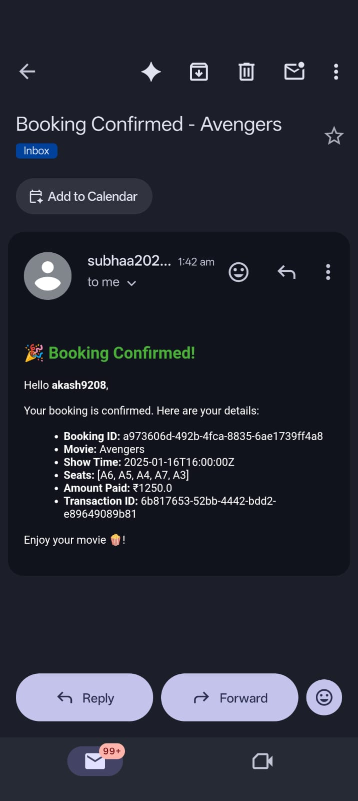
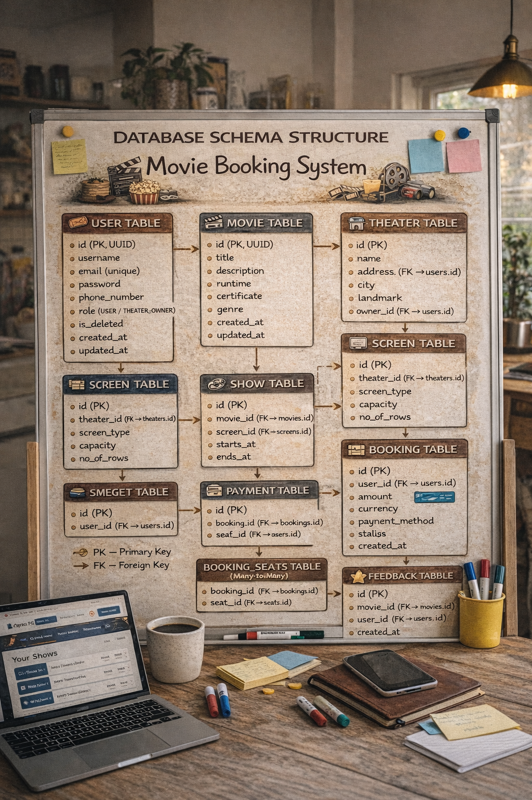
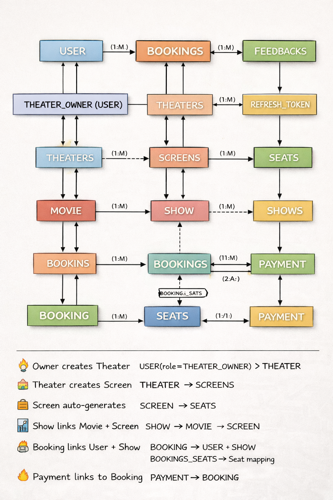

# 🚀 Movie Booking System API

A **Movie Booking System** built using **Spring Boot 3**, **Spring Security 6**, **JWT**, **MySQL**, and **Hibernate/JPA**.
This system allows users to register, login, view movies, book tickets, provide feedback, and manage theaters, screens, and shows.
it is a secure, role-based RESTful backend application that simulates a real-world cinema ticket booking platform.
---


It supports:

- Multirole authentication (USER & THEATER_OWNER)
- JWT-based stateless security
- Refresh token rotation
- Automatic seat generation
- Booking & payment workflow
- Email confirmation after successful booking
- Role-based endpoint protection

---

## Base URL

```
http://localhost:8080/api/v1
```

Swagger UI (API documentation & testing):

```
http://localhost:8080/api/v1/swagger-ui.html
```
------------------------------------------------------------------------
# 📂 Project Structure
```
movie-ticket-booking-system-api/
│── src/main/java/com/example/moviebooking/
│   ├── config/        # Security & JWT configuration
│   ├── controller/    # REST controllers
│   ├── dto/           # Data Transfer Objects
│   ├── entity/        # JPA entities
│   ├── exception/     # Custom exceptions & handlers
│   ├── mapper/        # MapStruct mappers for DTO ↔ Entity conversion
│   ├── repository/    # JPA repositories
│   ├── service/       # Business logic
│   └── security/      # Authentication & authorization
│── src/main/resources/
│   ├── application.yml # DB & security configs
│── pom.xml

```

------------------------------------------------------------------------

# 🏗️ Project Architecture (3-Tier Layered Design)

    ┌──────────────────────────────┐
    │      Controller Layer        │  ← REST API Endpoints
    └──────────────┬───────────────┘
                   │
    ┌──────────────▼───────────────┐
    │        Service Layer         │  ← Business Logic
    └──────────────┬───────────────┘
                   │
    ┌──────────────▼───────────────┐
    │      Repository Layer        │  ← Database Access
    └──────────────┬───────────────┘
                   │
    ┌──────────────▼───────────────┐
    │          MySQL DB            │
    └──────────────────────────────┘

------------------------------------------------------------------------

# 🔐 Security Architecture

### Authentication Flow

    Login Request
       ↓
    AuthService
       ↓
    Password Verification
       ↓
    Generate JWT Access Token
       ↓
    Generate Refresh Token (Stored as HASH in DB)
       ↓
    Return:
       - Access Token (JSON)
       - Refresh Token (HttpOnly Cookie)

### Security Features

-   Stateless JWT Authentication
-   Refresh Token Rotation
-   Refresh Token Hashing (SHA-256)
-   Token  Delete
-   Role-based Access Control
-   HttpOnly Secure Cookies

------------------------------------------------------------------------
# COMPLETE OWNER FLOW
```
Register as THEATER_OWNER
↓
Login (Get JWT)
↓
Create Theater
↓
Add Screens
↓
Schedule Shows
↓
Monitor Bookings
↓
Track Revenue
```
---
# COMPLETE USER JOURNEY
---
```
Register → Login → JWT
↓
Browse Movie
↓
Book Seat (PENDING)
↓
Make Payment (SUCCESS)
↓
Booking → CONFIRMED
↓
Email Sent
↓
User gives Feedback
```
---

---

# 🏗 Tech Stack

* Backend: Spring Boot 3  
* Language: Java 17 & 21  
* Security: Spring Security 6 + JWT  
* Database: MySQL 8  
* ORM: JPA / Hibernate  
* API Testing: Postman  
* Documentation: Swagger (OpenAPI)  
* Email: Spring Mail (SMTP)  
* Cache: Caffeine
* Lombok
* Maven

---

## Database Configuration (`application.yml`)

```yaml
spring:
  datasource:
    driver-class-name: com.mysql.cj.jdbc.Driver
    url: jdbc:mysql://localhost:3306/******?createDatabaseIfNotExist=true&useSSL=false&allowPublicKeyRetrieval=true&serverTimezone=UTC
    username: *****
    password: *****

  jpa:
    show-sql: true
    hibernate:
      ddl-auto: update
    properties:
      hibernate:
        dialect: org.hibernate.dialect.MySQL8Dialect
        format_sql: true

server:
  port: 8080
  servlet:
    context-path: /api/v1

app:
  token:
    secret: "MzY3NjQ3MTY0NzE2NDcxNjQ3MTY0NzE2NDcxNjQ3MTY0NzE2NDcxNjQ3MTY0NzE2NA=="
    accessDuration: 15   # in minutes
    refreshDuration: 60  # in minutes
```

---

## Entities Overview

| Entity       | Description                                      |
| ------------ | ------------------------------------------------ |
| UserDetails  | Base class for all users                         |
| User         | Regular user with bookings and feedback          |
| TheaterOwner | User who can manage theaters                     |
| Theater      | Contains screens and shows                       |
| Screen       | Contains seats and shows                         |
| Seat         | Seats inside a screen                            |
| Movie        | Movie details including cast, genre, certificate |
| Show         | Movie show timings in theaters/screens           |
| Booking      | User booking of seats in a show                  |
| Payment      | Booking payment details                          |
| Feedback     | User feedback for movies                         |

---

## Enums

* `BookingStatus`: PENDING, CONFIRMED, CANCELLED, REFUNDED
* `Certificate`: A, UA, U
* `Genre`: ACTION, COMEDY, DRAMA, HORROR, ROMANCE, SCIENCE\_FICTION, THRILLER, ANIMATION, DOCUMENTARY
* `PaymentMethod`: CARD, UPI, NETBANKING, WALLET
* `ScreenType`: IMAX, TWO\_D, THREE\_D
* `UserRole`: USER, THEATER\_OWNER
* `TokenType`: ACCESS, REFRESH

---

## Security

* JWT based authentication for `ACCESS` and `REFRESH` tokens.
* `USER` role can access booking, feedback, and profile APIs.
* `THEATER_OWNER` role can manage theaters, screens, and shows.

Endpoints `/register` and `/login` are public, all other endpoints require a valid `ACCESS` token.

---

## API Endpoints

### User APIs

* **Register User**

    * POST `/register`
    * Request:

      ```json
      {
        "username": "akash_jena",
        "email": "akash@gmail.com",
        "password": "Pass@1234",
        "phoneNumber": "9876543210",
        "userRole": "USER",
        "dateOfBirth": "1995-05-10"
      }
      ```

* **Login User**

    * POST `/login`
    * Request:

      ```json
      {
        "email": "akash@gmail.com",
        "password": "Pass@1234"
      }
      ```

* **Get User by ID**

    * GET `/users/{userId}`
    * Requires `Authorization: Bearer <ACCESS_TOKEN>`

* **Update User**

    * PUT `/users/{userId}`
    * Request:

      ```json
      {
        "username": "akash_jena",
        "email": "akash@gmail.com",
        "phoneNumber": "9876543210",
        "dateOfBirth": "1995-05-10"
      }
      ```

* **Delete User**

    * DELETE `/users/{userId}`

### Movie APIs

* **Create Movie** - POST `/movies`
* **Get Movie** - GET `/movies/{movieId}`
* **Update Movie** - PUT `/movies/{movieId}`
* **Delete Movie** - DELETE `/movies/{movieId}`
* **List Movies** - GET `/movies`

### Theater APIs

* **Create Theater** - POST `/theaters`
* **Get Theater** - GET `/theaters/{theaterId}`
* **Update Theater** - PUT `/theaters/{theaterId}`
* **Delete Theater** - DELETE `/theaters/{theaterId}`

### Screen APIs

* **Create Screen** - POST `/screens`
* **Get Screen** - GET `/screens/{screenId}`
* **Update Screen** - PUT `/screens/{screenId}`
* **Delete Screen** - DELETE `/screens/{screenId}`

### Seat APIs

* **Create Seat** - POST `/seats`
* **Get Seat** - GET `/seats/{seatId}`
* **Update Seat** - PUT `/seats/{seatId}`
* **Delete Seat** - DELETE `/seats/{seatId}`

### Show APIs

* **Create Show** - POST `/shows`
* **Get Show** - GET `/shows/{showId}`
* **Update Show** - PUT `/shows/{showId}`
* **Delete Show** - DELETE `/shows/{showId}`

### Booking APIs

* **Create Booking** - POST `/bookings`
* **Get Booking** - GET `/bookings/{bookingId}`
* **Update Booking Status** - PUT `/bookings/{bookingId}`
* **Cancel Booking** - DELETE `/bookings/{bookingId}`

### Payment APIs

* **Create Payment** - POST `/payments`
* **Get Payment** - GET `/payments/{paymentId}`

### Feedback APIs

* **Add Feedback** - POST `/feedbacks`
* **Get Feedback** - GET `/feedbacks/{feedbackId}`

---
---

# 🔐 Authentication & Security

- Stateless JWT authentication
- Access Token + Refresh Token mechanism
- Refresh token rotation
- Role-based access control
- Custom AuthenticationEntryPoint
- Custom AccessDeniedHandler
- Secure password hashing (BCrypt)

---

# 👥 User Roles

## 🎟 USER
- Register & Login
- View movies and shows
- Select seats
- Create booking
- Make payment
- Receive email confirmation
- Submit feedback

## 🏢 THEATER_OWNER
- Add Movies
- Create Theaters
- Add Screens
- Auto-generate Seats
- Schedule Shows

---

# 💺 Automatic Seat Generation Logic

When a screen is created:

- Rows are generated alphabetically (A, B, C...)
- Seats per row are numbered (1–N)
- Seat names are generated like:
  A1, A2, A3...
  B1, B2, B3...

This logic ensures dynamic and scalable seat creation based on screen capacity and number of rows.

---

# 🎟 Complete System Flow

## 🏢 Theater Owner Flow

1. Register as THEATER_OWNER
2. Login
3. Create Movie
4. Create Theater
5. Add Screen (auto seat generation)
6. Schedule Show

## 👤 User Flow

1. Register as USER
2. Login
3. View available shows
4. Select seats
5. Create booking
6. Make payment
7. Receive booking confirmation email
8. Submit feedback

---

# 🖼 Images

## Booking Success Email Preview



## Database Schema



## Relationship Flow Diagram



---


# ⚙️ How To Run

1. Clone repository  
   git clone https://github.com/your-username/movie-ticket-booking-system-api.git

2. Configure MySQL in application.yml

3. Run application  
   mvn spring-boot:run

---

# 🏆 Why This Project Is Production-Level

✔ Clean layered architecture  
✔ DTO-based design  
✔ Transaction management  
✔ Concurrency handling for seat booking  
✔ JWT + Refresh Token rotation  
✔ Secure endpoint restriction  
✔ Role-based access control  
✔ Email integration  
✔ Caching support  
✔ Proper exception handling

---

# 👨‍💻 Author

Akash Jena  
Java Full Stack Developer  
Spring Boot | REST APIs | MySQL | JWT Security
